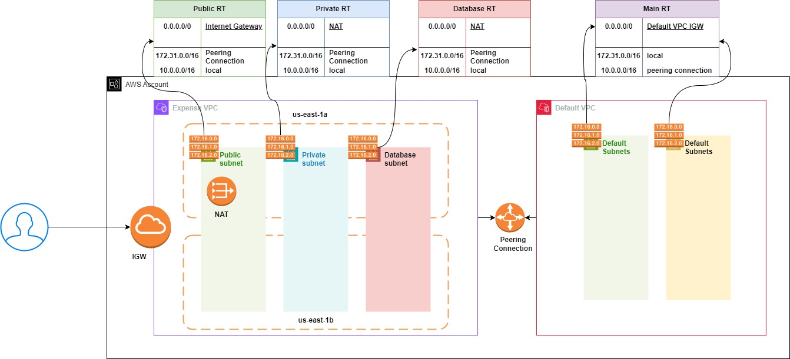

THIS IS A MODULE USED TO CREATE VPC ALONG WITH TWO PUBLIC. PRIVATE AND DB SUBNETS. 

USERS ARE FREE TO SELECT THE SUBNET RANGE OF THEIR CHOICE. 

ALSO PROVIDED AN OPTION SELECT THE VPC PEERING. 

We are creating following resources and the subnets are created in frist two az. 

1. VPC 
2. INTERNET GATEWAY ALONG WITH VPC ATTACHMENT
3. TWO PUBLIC , TWO PRIVATE AND TWO DB
4. ELASTIC IP WITH NAT GATEWAT ASSOCIATION 
5. CREATING ROUTE TABLES AND DEFING ROUTES INSIDE THEM FOR EXAMPLE PUBLIC ROUTE WITH INTERNET GATEWAY AND NATGATEWAY WITH INTERNET FOR PRIVATE AND DB SUBNET 
6. VPC PEERING IF REQUIRED
7. ROUTES FOR VPC PEERING IN BOTH ACCEPTOR AND REQUESTOR
8. DATA BASE SUBNET.